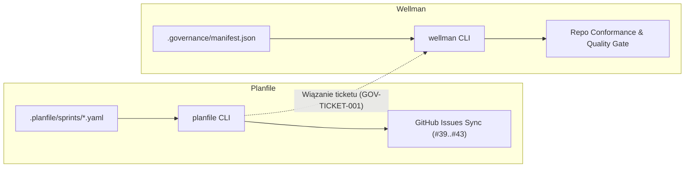

---
{
  "schema": "wellmanifest.docs/document/v1",
  "id": "wellman-vs-file-governance-comparative-analysis",
  "kind": "analysis",
  "version": 1,
  "title": "Analiza Porównawcza: Wellman (Policy-as-Code) vs Rozwiązanie Plikowo-Szablonowe w Standaryzacji Wellmanifest",
  "status": "current",
  "owner": "wellmanifest/wellman",
  "created": "2026-09-19",
  "updated": "2026-09-19",
  "affected_repositories": [
    "wellmanifest/wellman",
    "subactor/premesh"
  ]
}
---

# Analiza Porównawcza: Wellman (Policy-as-Code) vs Rozwiązanie Plikowo-Szablonowe

## 1. Wstęp i Cel Analizy

Przedmiotem niniejszej analizy jest ocena architektoniczna i operacyjna dwóch metod wdrażania standardów inżynierskich **Wellmanifest** w ekosystemie projektów autonomicznych:
1. **Model dotychczasowy (plikowo-szablonowy)**: oparty o pliki instruktażowe Markdown ([`AGENTS.md`](file:///workspace/github/subactor/premesh/AGENTS.md)), powielane skrypty sprawdzające (`wellmanifest_governance.py`) oraz deklaracje biletowe w katalogach `.planfile/`.
2. **Model nowy (`wellman` / Policy-as-Code)**: oparty o ujednolicone narzędzie CLI/Python, zdeklarowany plik `.governance/manifest.json`, kompozycyjne profile (`baseline`, `runtime-service`, `agent-executor`) oraz deterministyczne bramki (`wellman check`, `wellman gate`).

Dokument odpowiada na pytania dotyczące celowości migracji, różnic w konsumpcji zasobów (w tym tokenów LLM), ryzyk operacyjnych oraz współistnienia z narzędziami śledzenia zadań (`planfile`).

---

## 2. Zestawienie Porównawcze

| Wymiar | Model Plikowo-Szablonowy (Status Quo) | Model Wellman (Policy-as-Code) |
|:---|:---|:---|
| **Lokalizacja logiki sprawdzającej** | Vendoring skryptów `wellmanifest_governance.py` w każdym repozytorium (setki KB powielanego kodu). | Scentralizowana, lekka biblioteka `wellman` bez zewnętrznych zależności w warstwie bazowej. |
| **Interpretacja zasad** | Agent AI czyta tekst Markdown i subiektywnie ocenia zgodność w kontekście zapytania. | Deterministyczny silnik wykonawczy weryfikuje stan repozytorium maszynowo (`exit code 0/1`). |
| **Zużycie tokenów LLM** | 500–2000 tokenów na każde zapytanie systemowe (duże bloki instrukcji w `AGENTS.md`). | Zero tokenów na definicję reguł; agent otrzymuje jedynie zwięzły wynik JSON w razie uchybienia. |
| **Aktualizacja standardu** | Ręczna lub półautomatyczna aktualizacja plików w kilkudziesięciu repozytoriach (wysoki dryf standardu). | Aktualizacja wersji paczki `wellman` w potoku CI natychmiast ujednolica sprawdzanie we flocie. |
| **Wsparcie dla bramek CI/CD** | Zróżnicowane skrypty bashowe, trudne do utrzymania i parametryzacji. | Jednolite polecenie `wellman gate` integrowalne z GitHub Actions, GitLab CI i pre-commit hookami. |
| **Zależności środowiskowe** | Zerowe (pliki tekstowe istnieją niezależnie od środowiska wykonawczego). | Wymaga obecności interpretera Python (>=3.9) oraz instalacji pakietu `wellman`. |

---

## 3. Szczegółowa Analiza Zalety Rozwiązania Wellman

### 3.1. Eliminacja Zjawiska „Standard Drift”
W modelu plikowym standardy ewoluują asynchronicznie. Przykładowo reguła autonomicznego scalania PR (`wellmanifest/merge@ticket-008`) potrafi różnić się brzmieniem między repozytoriami `platform`, `core` i `premesh`. W `wellman` definicja standardu jest zlokalizowana w jednym miejscu ([`registry.py`](file:///workspace/github/wellmanifest/wellman/src/wellman/registry.py)), a repozytoria podają jedynie wersję i profil w `.governance/manifest.json`.

### 3.2. Drastyczna Optymalizacja Kontekstu Agenta AI
Modele językowe pracujące w paradygmacie Agentic Coding mają ograniczony context window oraz podatność na tzw. *prompt dilution* (rozmycie uwagi przy długich instrukcjach systemowych). `wellman` zdejmuje z agenta konieczność ciągłego procesowania reguł formalnych w promptcie – agent skupia się na kodzie zadania, a zgodność weryfikuje uruchamiając deterministyczne narzędzie:
```bash
wellman check --json
```

### 3.3. Kompozycyjne Profile Zamiast Ręcznego Składania
Zamiast żmudnego kopiowania reguł dla każdego nowego mikroserwisu, `wellman` udostępnia gotowe profile:
- Prosty mikroserwis domenowy: `wellman adopt baseline`
- Serwis sieciowy i koordynacyjny floty: `wellman adopt runtime-service`
- Autonomiczny agent wykonawczy z KVM i naprawą: `wellman adopt agent-executor`

---

## 4. Analiza Wad, Ryzyk i Ograniczeń

### 4.1. Narzut Środowiskowy (Toolchain Dependency)
Proste pliki Markdown i skrypty bash działają na dowolnej maszynie POSIX bez wcześniejszej konfiguracji. `wellman` wymaga obecności środowiska Python oraz zainstalowanej biblioteki. W środowiskach minimalistycznych kontenerów typu Alpine/Distroless lub w środowiskach typu `noexec` / minimal embedded wymaga to dostarczenia środowiska wykonawczego.

### 4.2. Ryzyko Przeformalizowania (Over-Governance)
Zbyt restrykcyjne bramki (np. rygorystyczne sprawdzanie prefixów gałęzi `GOV-GIT-001` podczas fazy wczesnego prototypowania) mogą spowalniać zwinne eksperymenty programistyczne. Konieczne jest wsparcie dla flagi `--allow-draft` lub stopniowania rygoru w zależności od typu gałęzi.

### 4.3. Koszt Migracji Istniejącej Floty
Organizacja posiada kilkadziesiąt repozytoriów z zaszłościami w postaci plików `wellmanifest_governance.py`. Przejście na `wellman` wymaga:
1. Usunięcia osieroconych skryptów vendored,
2. Wygenerowania `.governance/manifest.json` przez `wellman adopt`,
3. Zaktualizowania definicji workflowów GitHub Actions.

---

## 5. Relacja Wellman z Narzędziem Planfile

Częstym błędem poznawczym jest traktowanie `wellman` i `planfile` jako rozwiązań konkurencyjnych. W rzeczywistości realizują one ortogonalne warstwy odpowiedzialności:



- **`planfile`**: zarządza cyklem życia zadań, sprintami, zależnościami DAG oraz synchronizacją z zewnętrznymi trackerami (GitHub Issues, GitLab, Jira).
- **`wellman`**: pilnuje integralności inżynierskiej, architektury repozytorium, braku kolizji worktree i zgodności z kontraktami Wellmanifest.

---

## 6. Wnioski i Rekomendacje Wdrożeniowe

1. **Rekomendacja Główna**: Przyjęcie `wellman` jako strategicznego standardu governance jest w pełni uzasadnione i znacząco przewyższa dotychczasowe podejście plikowe pod względem skalowalności, determinizmu i ekonomiki tokenów AI.
2. **Krok Wdrożeniowy dla `premesh`**:
   Zaleca się przeprowadzenie formalnego bootstrapu repozytorium `subactor/premesh`:
   ```bash
   wellman adopt runtime-service --root /workspace/github/subactor/premesh
   ```
   oraz dodanie kroku `wellman gate` w skryptach testowych repozytorium.
3. **Harmonogram Migracji Floty**:
   Migrację pozostałych repozytoriów organizacji należy prowadzić etapami, rozpoczynając od profilu `baseline`, a następnie podnosząc poziom do `runtime-service` i `agent-executor`.
