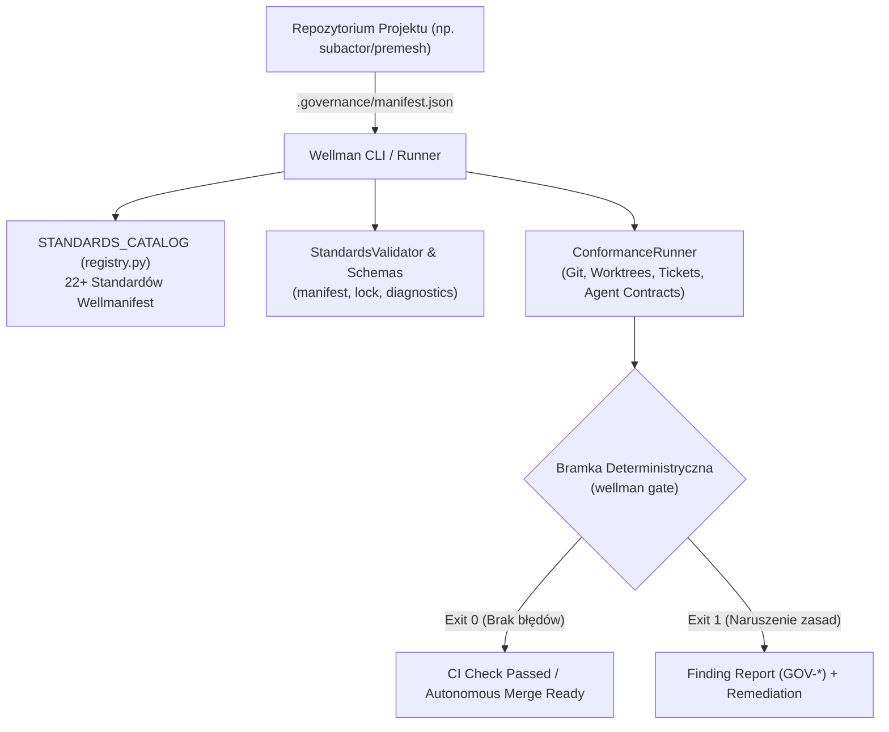

---
{
  "schema": "wellmanifest.docs/document/v1",
  "id": "wellman-standards-runtime",
  "kind": "information",
  "version": 1,
  "title": "Wellman Unified Standards Runtime: Specyfikacja Architektury i Katalog Standardów",
  "status": "current",
  "owner": "wellmanifest/wellman",
  "created": "2026-09-19",
  "updated": "2026-09-19",
  "affected_repositories": [
    "wellmanifest/wellman",
    "subactor/premesh"
  ]
}
---

# Wellman Unified Standards Runtime

## 1. Wstęp i Cel Architektoniczny

`wellman` to ujednolicony silnik wykonawczy, katalog standardów i walidator Policy-as-Code (PaC) dla ekosystemu **Wellmanifest**. 

Dotychczasowe egzekwowanie standardów inżynierskich i zarządczych w projektach organizacji opierało się na metodzie plikowo-szablonowej:
- Ręcznym kopiowaniu setek kilobajtów skryptów sprawdzających (`wellmanifest_governance.py`) do każdego repozytorium,
- Definiowaniu zasad w języku naturalnym i komentarzach HTML w plikach `AGENTS.md`,
- Braku scentralizowanego, deterministycznego narzędzia CLI weryfikującego stan projektu w potokach CI/CD.

`wellman` rozwiązuje ten problem poprzez:
1. **Zero vendoringu kodu governance**: pojedyncza, lekka paczka Python (bez zewnętrznych zależności w warstwie bazowej), instalowana globalnie lub w środowisku wirtualnym (`pip install wellman`).
2. **Deklaratywny manifest projektu**: standaryzacja jest aktywowana w repozytorium za pomocą zwięzłego pliku `.governance/manifest.json`.
3. **Katalog 22+ standardów Wellmanifest**: zdefiniowane poziomy zgodności (S0–S5) oraz modele wykonawcze (`reference-only`, `local-conformance`, `protected-conformance`, `runtime-conformance`).
4. **Deterministyczne bramki jakościowe**: komendy `wellman check`, `wellman gate` i `wellman validate` z jednoznacznymi kodami ustaleń (`GOV-*`) i instrukcjami naprawczymi (`Remediation: ...`).

---

## 2. Architektura Przepływu Sterowania



---

## 3. Poziomy Zgodności Conformance Levels (S0 – S5)

Każdy pakiet standardu w `wellman` przypisany jest do minimalnego wymaganego poziomu dojrzałości:

| Poziom | Definicja Formalna | Wymaganie Walidacji |
|:---:|:---|:---|
| **S0** | Wersjonowany kontrakt normatywny | Zamknięte schematy JSON i negatywne przypadki testowe. |
| **S1** | Deterministyczna komenda zgodności | Komenda bez zewnętrznych zależności ze stabilnymi kodami ustaleń (`Finding`). |
| **S2** | Niezmienna rewizja źródłowa | Sumy kontrolne SHA-256 dla każdej zarządzanej projekcji repozytorium. |
| **S3** | Wymagany check w CI | Komenda zgodności uruchamiana jako stabilny, wymagany status check na pull requestach. |
| **S4** | Ochrona gałęzi i rulesets | Reguły GitHub Rulesets / Branch Protection wymagają zielonego checku przed scaleniem. |
| **S5** | Runtime z dowodami kryptograficznymi | Środowisko uruchomieniowe waliduje aktywne wiązania i emituje podpisany receipt. |

---

## 4. Profile Kompozycyjne (Governance Profiles)

Zamiast ręcznego dobierania poszczególnych standardów, `wellman` udostępnia profile kompozycyjne:

1. **`baseline`**:
   - Obowiązkowy profil dla wszystkich standardowych repozytoriów.
   - Pakiety: `new-project` (S4), `git-lifecycle` (S4), `worktrees` (S3), `merge` (S4), `validation-attestation` (S4), `ticket-lifecycle` (S3), `logs` (S3).
2. **`domain-pack`**:
   - Rozszerza `baseline` o specyfikacje gramatyk i DSL (`dsl` S4, `code-dsl` S4).
3. **`runtime-service`**:
   - Rozszerza `baseline` o runtime authority, POA i zaawansowane logowanie (`poa` S5, `authority-lifecycle` S5, `logs` S5).
   - **Rekomendowany profil dla runtime'u `premesh`**.
4. **`agent-executor`**:
   - Rozszerza `runtime-service` o autonomiczne agenty AI, naprawę i umiejętności (`agent` S4, `repair-lifecycle` S5, `validation-attestation` S5, `skills` S4, `llm` S4).
5. **`deployment`**:
   - Rozszerza `runtime-service` o topologie wdrożeniowe i release gates (`deployment` S5, `merge` S5).
6. **`full`**:
   - Pełny zbiór wszystkich 25 standardów Wellmanifest.

---

## 5. Przykładowa Deklaracja `.governance/manifest.json`

```json
{
  "schema": "wellmanifest.new-project/manifest/v1",
  "project": "premesh",
  "owner": "subactor/premesh",
  "profile": "runtime-service",
  "standards": [
    {
      "id": "wellmanifest/new-project",
      "level": "S4"
    },
    {
      "id": "wellmanifest/git-lifecycle",
      "level": "S4"
    },
    {
      "id": "wellmanifest/worktrees",
      "level": "S3"
    },
    {
      "id": "wellmanifest/merge",
      "level": "S4"
    },
    {
      "id": "wellmanifest/docs",
      "level": "S3"
    },
    {
      "id": "wellmanifest/taskand",
      "level": "S4"
    }
  ]
}
```

---

## 6. Procedury Operacyjne CLI

- **Sprawdzenie zgodności**:
  ```bash
  wellman check --root .
  ```
- **Uruchomienie deterministycznej bramki CI**:
  ```bash
  wellman gate --root .
  ```
- **Adopcja profilu do nowego lub istniejącego projektu**:
  ```bash
  wellman adopt runtime-service --root .
  ```
- **Inspekcja standardu**:
  ```bash
  wellman info wellmanifest/worktrees
  ```
